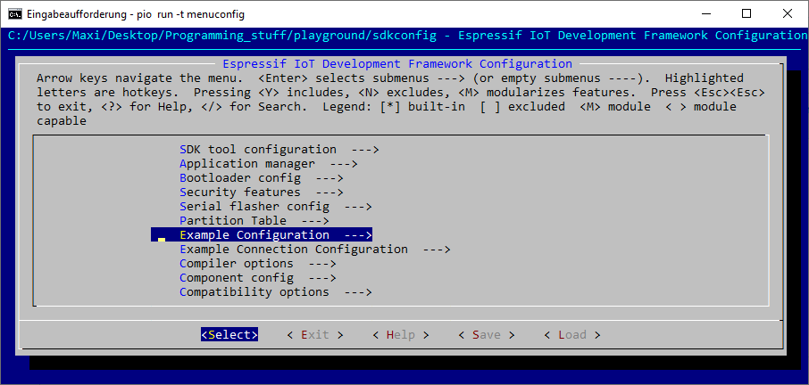
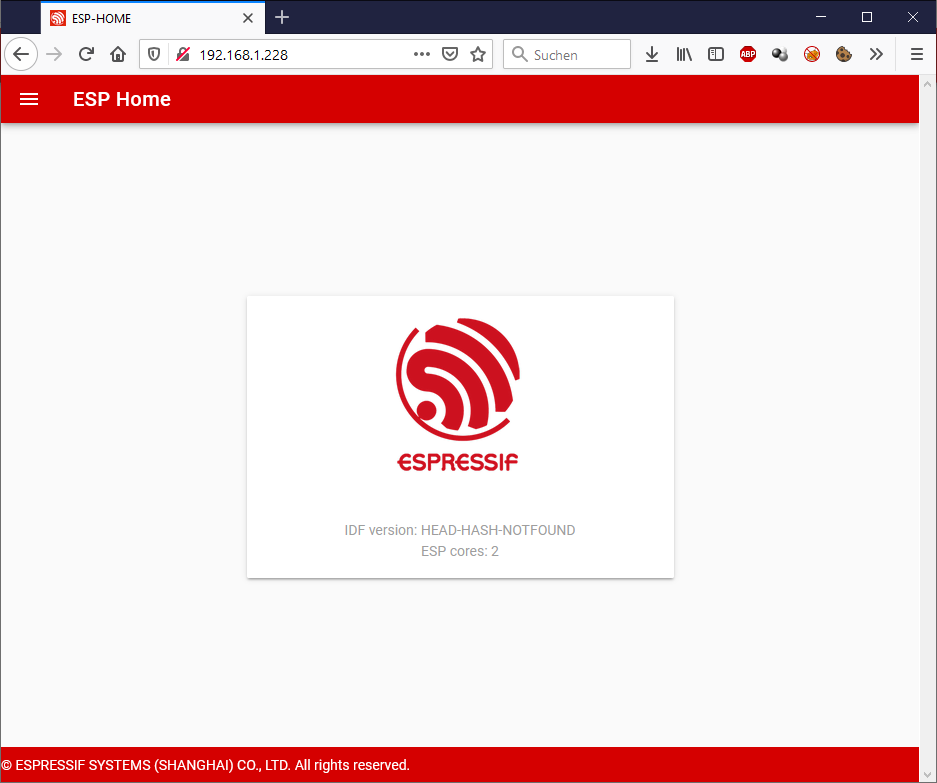

# ESP-IDF RESTful Webserver Example for PlatformIO 

# Compile

As normal, the "Build", "Upload" and **"Upload SPIFFS image"** should be used. 

Or 

```
pio run -t upload
pio run -t uploadfs
```

# Configuration

Settings like the WiFi you're connecting to must be set in the `sdkconfig`.  Use the `pio run -t menuconfig` command to get into the configuration menu. 



# Frontend

The frontend was compiled locally using `npm` (`npm install` and `npm run build` in the frontend folder, as instructed in the `main/CMakeLists.txt`) and is uploaded into the SPIFFs of the ESP32. This is then viewable via WiFi.



# Expected Output 

```
[...]
I (2595) tcpip_adapter: sta ip: 192.168.1.228, mask: 255.255.255.0, gw: 192.168.1.1
I (3595) example_connect: Connected to <your WiFi here>
I (3595) example_connect: IPv4 address: 192.168.1.228
I (3595) example_connect: IPv6 address: fe80:0000:0000:0000:260a:c4ff:fe04:2638
I (3805) example: Partition size: total: 1920401, used: 511036
I (3805) esp-rest: Starting HTTP Server
```
